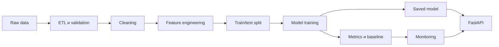
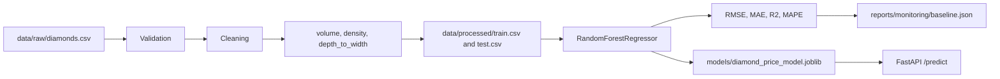
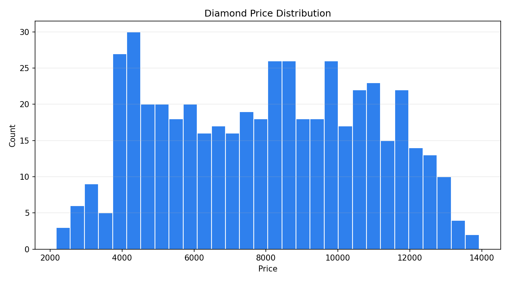
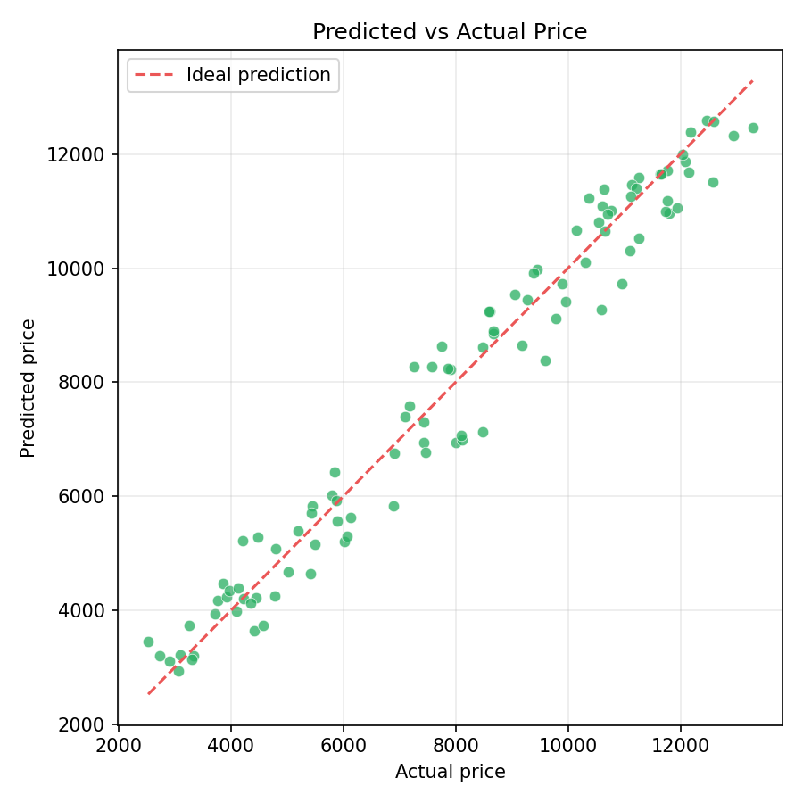
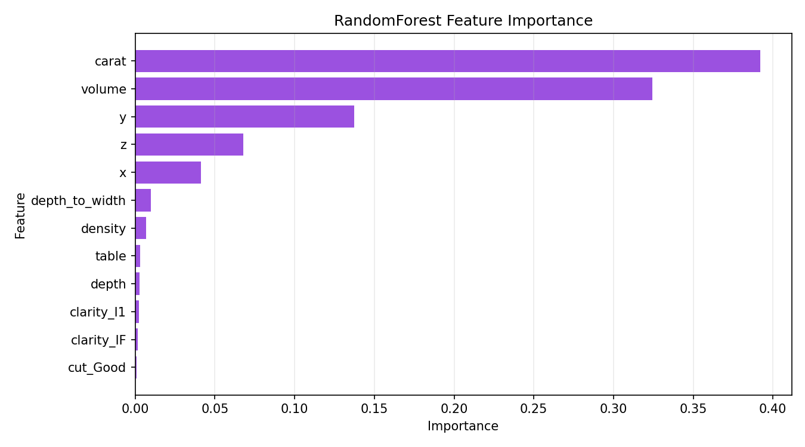

# Automation ML Diamonds

[](https://www.python.org/)
[](https://fastapi.tiangolo.com/)
[](https://docs.pytest.org/)
[](https://docs.docker.com/compose/)
[](LICENSE)

MLOps-проект для предсказания стоимости бриллиантов.

Текущая версия: `1.0.0`

Проект демонстрирует воспроизводимый ML workflow для табличной задачи регрессии: предсказание цены бриллианта (`price`) по данным Kaggle Diamonds Dataset.

Основной акцент сделан на понятной архитектуре, стабильном локальном запуске, автоматизированных тестах, Docker, CI/CD, monitoring и прозрачной структуре репозитория.

## Бизнес-задача

Нужно предсказать стоимость бриллианта по его характеристикам:

- `carat`
- `cut`
- `color`
- `clarity`
- `depth`
- `table`
- `x`
- `y`
- `z`

Целевая переменная: `price`

Тип задачи: регрессия

Датасет: [Kaggle Diamonds Dataset](https://www.kaggle.com/datasets/shivam2503/diamonds)

Презентация - https://drive.google.com/file/d/1yhTzTyjb7gmj4y4bQLWzS0v7sFHl4q5n/view?usp=sharing 

## Почему выбран Diamonds Dataset

- Датасет простой, интерпретируемый и хорошо подходит для проверки полного ML workflow.
- Данные табличные, есть числовые и категориальные признаки.
- Целевая переменная понятна: цена бриллианта.
- На этом датасете удобно показать ETL, preprocessing, feature engineering, model training, FastAPI, tests, Docker, CI/CD и monitoring.
- В отличие от NLP-задач, проект не перегружается обработкой текста и остается сфокусированным на MLOps.

## Архитектурная схема



## Схема pipeline



## Автоматизация ML pipeline

Для задачи регрессии на табличных данных выбран `RandomForestRegressor` как стабильный baseline. Автоматизация реализована через единый `sklearn Pipeline` с `ColumnTransformer`: numeric и categorical features обрабатываются единообразно, а preprocessing становится частью обучаемого pipeline.

Такой подход обеспечивает воспроизводимость, уменьшает риск расхождения между training и inference и упрощает поддержку модели. При обучении pipeline выполняет imputation, scaling, encoding и fit модели; при inference тот же pipeline применяет сохраненную preprocessing-логику перед prediction.

## Что реализовано

- ETL pipeline: загрузка данных, validation, cleaning, feature engineering и сохранение обработанных данных.
- Реальное обучение модели `RandomForestRegressor`.
- Реальные метрики после обучения: RMSE, MAE, R2, MAPE.
- FastAPI-приложение с endpoint-ами для health check, prediction и информации о модели.
- Легкий monitoring:
  - baseline metrics;
  - data drift по числовым признакам;
  - degradation detection;
  - CPU/RAM/disk usage через `psutil`.
- Тесты на небольших synthetic DataFrame, поэтому полный Kaggle dataset для проверки не нужен.
- Docker и Docker Compose.
- GitHub Actions workflow для тестов и Docker build.

## Структура проекта

```text
.
|-- data/
|   |-- raw/
|   `-- processed/
|-- src/
|   |-- app.py
|   |-- data_processing.py
|   |-- infrastructure_monitoring.py
|   |-- model_training.py
|   `-- monitoring.py
|-- tests/
|   |-- test_api.py
|   |-- test_data.py
|   |-- test_model.py
|   `-- test_monitoring.py
|-- docker/
|   |-- Dockerfile
|   `-- prometheus.yml
|-- .github/workflows/
|   `-- ci-cd.yml
|-- models/
|-- reports/
|   |-- figures/
|   `-- monitoring/
|-- presentation/
|   `-- presentation.md
|-- run_pipeline.py
|-- docker-compose.yml
|-- requirements.txt
`-- README.md
```

## Быстрый старт

Создать и активировать виртуальное окружение на Windows:

```bash
python -m venv .venv
.venv\Scripts\activate
```

Установить зависимости:

```bash
pip install -r requirements.txt
```

Запустить полный ML pipeline:

```bash
python run_pipeline.py
```

Ожидаемый вывод:

```text
Pipeline completed
rmse: 589.5855
mae: 483.1370
r2: 0.9631
mape: 7.0597
```

Если вместо sample dataset использовать полный Kaggle CSV, значения метрик могут измениться.

## Подготовка датасета

Для работы с реальным Kaggle dataset нужно положить CSV-файл сюда:

```text
data/raw/diamonds.csv
```

Если файла нет, проект автоматически создаст небольшой deterministic diamonds-like dataset. Это позволяет запускать tests, Docker build и локальный пример без ручной загрузки Kaggle.

## Запуск ETL

```bash
python -m src.data_processing
```

Ожидаемый вывод:

```text
Saved processed train/test data: train=400, test=100
```

Создаваемые файлы:

- `data/raw/diamonds.csv`, если исходного файла не было;
- `data/processed/train.csv`;
- `data/processed/test.csv`;
- `data/processed/diamonds_processed.csv`.

## ETL Pipeline

### Extract

- Загрузка diamonds dataset из `data/raw/diamonds.csv`.
- Источник данных: [Kaggle Diamonds Dataset](https://www.kaggle.com/datasets/shivam2503/diamonds).
- Если CSV отсутствует, создается deterministic sample dataset для воспроизводимого локального запуска.
- На этапе validation проверяются обязательные колонки, непустой датасет и числовые типы данных для numeric features.

### Transform

- Удаляются дубликаты и строки с пропусками в обязательных колонках.
- Отфильтровываются некорректные физические значения: неположительные `carat`, `price`, `x`, `y`, `z`, `depth`, `table`.
- Добавляется feature engineering:
  - `volume = x * y * z`;
  - `density = carat / (volume + 0.001)`;
  - `depth_to_width = depth / (x + 0.001)`.
- В ML pipeline выполняется preprocessing:
  - median imputation и scaling для numeric features;
  - most-frequent imputation и one-hot encoding для categorical features;
  - train/test split с фиксированным `random_state`.

### Load

- Processed dataset сохраняется в `data/processed/`.
- Trained model artifact сохраняется в `models/diamond_price_model.joblib`.
- Metrics сохраняются в `models/metrics.json`.
- Monitoring baseline сохраняется в `reports/monitoring/baseline.json`.
- Визуализации для отчета генерируются в `reports/figures/`.

## Обучение модели

```bash
python -m src.model_training
```

Ожидаемый вывод - JSON с реальными метриками:

```json
{
  "rmse": 589.5855030260883,
  "mae": 483.1369603844394,
  "r2": 0.9631170911086028,
  "mape": 7.059739162247622
}
```

Создаваемые файлы:

- `models/diamond_price_model.joblib`;
- `models/metrics.json`;
- `reports/monitoring/baseline.json`.

## Визуализации

Графики для отчета находятся в `reports/figures/`. Их можно пересоздать командой:

```bash
python -m src.visualization
```



`price_distribution.png` показывает распределение целевой переменной `price` и помогает оценить диапазон цен в используемом датасете.



`predicted_vs_actual.png` сравнивает реальные значения `price` с предсказаниями модели. Чем ближе точки к пунктирной диагонали, тем точнее модель.



`feature_importance.png` показывает наиболее важные признаки для `RandomForestRegressor`. В текущем запуске наибольший вклад дают `carat`, `volume` и размерные признаки.

## FastAPI

Запуск API локально:

```bash
uvicorn src.app:app --reload
```

Документация Swagger доступна по адресу:

```text
http://127.0.0.1:8000/docs
```

Endpoint-ы:

- `GET /` - базовая информация об API.
- `GET /health` - статус сервиса, статус модели и infrastructure metrics.
- `POST /predict` - предсказание цены бриллианта.
- `GET /model/info` - путь к модели, список признаков и сохраненные метрики.

Пример запроса для `POST /predict`:

```json
{
  "carat": 0.5,
  "cut": "Ideal",
  "color": "E",
  "clarity": "SI1",
  "depth": 61.5,
  "table": 55,
  "x": 5.1,
  "y": 5.0,
  "z": 3.1
}
```

Пример ответа:

```json
{
  "predicted_price": 4200.25,
  "message": "Prediction completed successfully."
}
```

Если модель еще не обучена, `/predict` вернет HTTP 503 с подсказкой запустить обучение. При этом импорт FastAPI-приложения не падает без файла модели.

## Тестирование

Запуск всех тестов:

```bash
pytest -v
```

Текущий ожидаемый результат:

```text
18 passed
```

Опциональная команда для coverage, если установлен `pytest-cov`:

```bash
pytest --cov=src --cov-report=term-missing
```

## Monitoring

Проверка infrastructure metrics:

```bash
python -m src.infrastructure_monitoring
```

Пример вывода:

```json
{
  "cpu_percent": 10.5,
  "ram_percent": 88.4,
  "disk_percent": 43.4
}
```

Monitoring в проекте легкий и встроенный. Он показывает baseline metrics, drift checks, degradation checks и состояние ресурсов без подключения внешних сервисов.

## Docker

Сборка image:

```bash
docker compose build
```

Запуск API:

```bash
docker compose up
```

Ожидаемое поведение:

- image устанавливает Python-зависимости;
- во время build запускаются ETL и model training, поэтому внутри image есть model artifact;
- API запускается на порту `8000`;
- Swagger доступен по адресу `http://127.0.0.1:8000/docs`.

## CI/CD

GitHub Actions workflow находится здесь:

```text
.github/workflows/ci-cd.yml
```

Workflow выполняет:

1. checkout репозитория;
2. настройку Python;
3. pip dependency cache;
4. установку зависимостей;
5. compile check для `src` и `tests`;
6. `python -m pytest -v`;
7. Docker image build.

Deploy, cloud integrations и secrets не добавлены специально: для проекта выбран простой и стабильный workflow без внешней инфраструктуры.

## Git workflow

Для работы с репозиторием использовался стандартный Git workflow:

```bash
git status
git add .
git commit -m "..."
git push origin main
```

Эти команды позволяют проверить состояние рабочей директории, добавить изменения, зафиксировать их в истории и отправить проект в GitHub-репозиторий.

## Решение частых проблем

### `ModuleNotFoundError`

Установить зависимости в активном окружении:

```bash
pip install -r requirements.txt
```

### `/predict` возвращает HTTP 503

Сначала обучить модель:

```bash
python -m src.model_training
```

### Нет Kaggle dataset

Это допустимо. Проект автоматически создаст deterministic sample dataset. Для работы с реальным датасетом нужно положить `diamonds.csv` в `data/raw/`.

### Docker build не запускается

Нужно запустить Docker Desktop, дождаться состояния Engine running и повторить:

```bash
docker compose build
```

## Скриншоты для документации

При подготовке внешнего описания проекта можно добавить скриншоты:

- Swagger UI на `/docs`;
- ответ endpoint-а `/health`;
- зеленый GitHub Actions workflow;
- запущенный Docker Compose.

## Возможные будущие улучшения

- Добавить `pytest-cov` и публиковать coverage в CI.
- Добавить сравнение нескольких моделей.
- Сделать простой monitoring dashboard или экспорт monitoring report.
- Добавить скриншоты в финальную документацию после ручной проверки.

## Статус проекта

Проект демонстрирует основные MLOps-компоненты:

- ETL;
- preprocessing;
- model training;
- реальные метрики;
- FastAPI;
- tests;
- Docker;
- CI/CD;
- monitoring;
- documentation.

Проект готов к публикации после добавления ссылки на GitHub-репозиторий и нужных скриншотов во внешнюю документацию.
